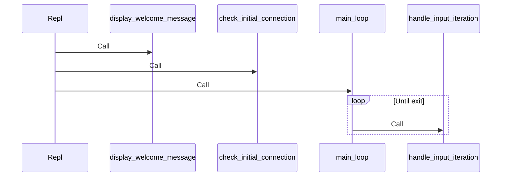

# Top 3 Refactoring Opportunities for OllamaRepl

Based on codebase analysis, these are the three highest-impact refactoring opportunities:

1. Implement a ModeFactory to centralize mode creation
2. Develop an extensible command registration system
3. Refactor the Repl's run method for better maintainability

## 1. Implement ModeFactory

### Rationale
Currently, mode creation logic is duplicated in both `switch_mode` and `run_in_mode` methods in the Repl class. This introduces maintenance issues, as adding a new mode requires changes in multiple places.

### Implementation Steps

```mermaid
classDiagram
    ModeFactory --> Client
    ModeFactory --> ContextManager
    ModeFactory --> "Mode Implementations"
    Repl --> ModeFactory
    class ModeFactory {
        -client
        -context_manager
        +create(mode_type)
    }
```

1. **Create ModeFactory Class**:
   ```ruby
   # lib/ollama_repl/mode_factory.rb
   module OllamaRepl
     class ModeFactory
       def initialize(client, context_manager)
         @client = client
         @context_manager = context_manager
       end
       
       def create(mode_type)
         case mode_type
         when :llm
           Modes::LlmMode.new(@client, @context_manager)
         when :ruby
           Modes::RubyMode.new(@client, @context_manager)
         when :shell
           Modes::ShellMode.new(@client, @context_manager)
         else
           raise ArgumentError, "Unknown mode type '#{mode_type}'"
         end
       end
     end
   end
   ```

2. **Update Repl to Use ModeFactory**:
   ```ruby
   # In lib/ollama_repl/repl.rb
   
   # Add require
   require_relative "mode_factory"
   
   # Update initialize method
   def initialize(dependencies = {})
     # existing code...
     @mode_factory = dependencies[:mode_factory] || ModeFactory.new(@client, @context_manager)
     @current_mode = dependencies[:initial_mode] || @mode_factory.create(:llm)
     # rest of initialize...
   end
   
   # Update switch_mode method
   def switch_mode(mode_type)
     begin
       @current_mode = @mode_factory.create(mode_type)
       mode_name = @current_mode.class.name.split("::").last.gsub("Mode", "")
       @io_service.display("Switched to #{mode_name} mode.")
     rescue ArgumentError => e
       @io_service.display_error(e.message)
     end
   end
   
   # Update run_in_mode method
   def run_in_mode(mode_type, input)
     begin
       mode_instance = @mode_factory.create(mode_type)
       mode_instance.handle_input(input)
     rescue ArgumentError => e
       @io_service.display_error(e.message)
     rescue => e
       @io_service.display_execution_error(mode_type.to_s, e)
     end
   end
   ```

## 2. Develop an Extensible Command Registration System

### Rationale
The current CommandHandler uses a large case statement to handle different commands. This approach makes it difficult to add new commands without modifying the CommandHandler class itself.

### Implementation Steps

```mermaid
classDiagram
    CommandHandler --> CommandRegistry
    CommandRegistry --> "Command Interface"
    HelpCommand --|> "Command Interface"
    ModelCommand --|> "Command Interface"
    LlmCommand --|> "Command Interface"
    FileCommand --|> "Command Interface"
    class CommandRegistry {
        -commands
        +register(name, command)
        +get_command(name)
        +has_command?(name)
    }
    class "Command Interface" {
        +execute(args, context)
    }
```

1. **Create Command Interface and Registry**:
   ```ruby
   # lib/ollama_repl/commands/command.rb
   module OllamaRepl
     module Commands
       class Command
         def execute(args, context)
           raise NotImplementedError, "#{self.class.name} must implement #execute"
         end
       end
     end
   end
   
   # lib/ollama_repl/command_registry.rb
   module OllamaRepl
     class CommandRegistry
       def initialize
         @commands = {}
       end
       
       def register(name, command)
         @commands[name.to_s.downcase] = command
       end
       
       def get_command(name)
         @commands[name.to_s.downcase]
       end
       
       def has_command?(name)
         @commands.key?(name.to_s.downcase)
       end
       
       def command_names
         @commands.keys
       end
     end
   end
   ```

2. **Implement Specific Commands**:
   ```ruby
   # lib/ollama_repl/commands/help_command.rb
   module OllamaRepl
     module Commands
       class HelpCommand < Command
         def initialize(io_service, command_registry)
           @io_service = io_service
           @command_registry = command_registry
         end
         
         def execute(args, context)
           @io_service.display("\n--- Ollama REPL Help ---")
           # Display help content similar to current implementation
           @io_service.display("------------------------\n")
         end
       end
     end
   end
   
   # Similar implementations for other commands...
   ```

3. **Update CommandHandler to Use Registry**:
   ```ruby
   # lib/ollama_repl/command_handler.rb
   require_relative "command_registry"
   require_relative "commands/command"
   require_relative "commands/help_command"
   # require other command implementations...
   
   module OllamaRepl
     class CommandHandler
       def initialize(repl, context_manager, io_service)
         @repl = repl
         @context_manager = context_manager
         @io_service = io_service
         @registry = CommandRegistry.new
         
         # Register commands
         setup_commands
       end
       
       def handle(input)
         parts = input.split(" ", 2)
         command_name = parts[0].downcase
         args = parts[1]
         
         if @registry.has_command?(command_name)
           command = @registry.get_command(command_name)
           context = {
             repl: @repl,
             context_manager: @context_manager,
             io_service: @io_service
           }
           command.execute(args, context)
         else
           @io_service.display("Unknown command: #{command_name}. Type /help for available commands.")
         end
       end
       
       private
       
       def setup_commands
         @registry.register("/help", Commands::HelpCommand.new(@io_service, @registry))
         @registry.register("/llm", Commands::LlmCommand.new(@repl, @io_service))
         # Register other commands...
       end
     end
   end
   ```

## 3. Refactor Repl's Run Method

### Rationale
The run method in the Repl class is complex, handling multiple responsibilities like displaying welcome messages, checking connections, and managing the main input loop. Breaking it down into smaller, focused methods would improve maintainability and testability.

### Implementation Steps



1. **Break Down the Run Method**:
   ```ruby
   # In lib/ollama_repl/repl.rb
   
   def run
     display_welcome_message
     check_initial_connection
     
     main_loop
   rescue Error => e # Catch connection/config errors
     handle_fatal_error(e)
   end
   
   private
   
   def display_welcome_message
     @io_service.display("Welcome to Ollama REPL!")
     @io_service.display("Using model: #{@client.current_model}")
     @io_service.display("Type `/help` for commands.")
     
     # Pre-cache available models
     get_available_models
   end
   
   def check_initial_connection
     begin
       @client.check_connection_and_model
     rescue Client::ModelNotFoundError => e
       handle_model_not_found_error(e)
     end
   end
   
   def main_loop
     loop do
       begin
         result = handle_input_iteration
         break if result == :exit
       rescue Interrupt # Handle Ctrl+C
         @io_service.display("\nType /exit or /quit to leave.")
       rescue Client::ApiError => e
         @io_service.display_api_error(e.message)
       rescue => e
         @io_service.display_execution_error("general", e)
       end
     end
   end
   
   def handle_input_iteration
     prompt = current_prompt
     input = @io_service.prompt(prompt)
     
     # Handle EOF or nil input (Ctrl+D)
     if input.nil?
       @io_service.display("\nExiting.")
       return :exit
     end
     
     input.strip!
     
     # Add non-empty input to history
     Readline::HISTORY.push(input) unless input.empty?
     
     # Exit commands
     return :exit if ["/exit", "/quit"].include?(input.downcase)
     
     process_input(input)
     return :continue
   end
   
   def handle_fatal_error(error)
     @io_service.display_error(error.message)
     @io_service.display("Please check your OLLAMA_HOST and OLLAMA_MODEL settings and ensure Ollama is running.")
     exit 1
   end
   ```

## Summary of Benefits

These refactorings will significantly improve the codebase by:

1. **Centralizing mode creation logic** through the ModeFactory, making it easier to add new modes with changes to only one class.

2. **Creating an extensible command system** that allows adding new commands without modifying the CommandHandler, enabling better testing of individual commands.

3. **Breaking down the complex run method** into smaller, focused methods that each have a single responsibility, improving readability and testability.

Implementing these changes will result in a more maintainable, testable, and extensible codebase that better adheres to the SOLID principles of object-oriented design.