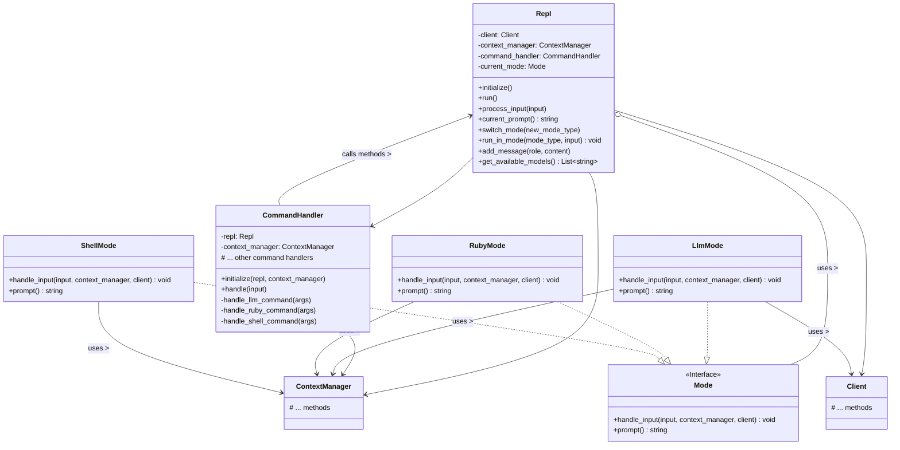

# Refactoring Plan: Implement Mode Strategy Pattern

This plan outlines the steps to refactor the `OllamaRepl::Repl` class to use the Strategy pattern for managing different interaction modes (LLM, Ruby, Shell), as recommended in Phase 1 of the `codebase_improvement_plan.md`.

## Goals

*   Replace the `case`-based mode switching in `Repl` with a Strategy pattern.
*   Encapsulate mode-specific logic (input handling, prompt generation) into separate `Mode` classes.
*   Improve code organization, maintainability, and extensibility for adding new modes.

## Proposed Steps

1.  **Define `Mode` Interface/Base Class:**
    *   Create `lib/ollama_repl/modes/mode.rb`.
    *   Define a base `Mode` class (or module) with abstract methods:
        *   `handle_input(input, context_manager, client)`: Handles input specific to the mode.
        *   `prompt`: Returns the prompt string for the mode.

2.  **Create Concrete Mode Classes:**
    *   Create `lib/ollama_repl/modes/llm_mode.rb`.
    *   Create `lib/ollama_repl/modes/ruby_mode.rb`.
    *   Create `lib/ollama_repl/modes/shell_mode.rb`.
    *   Each class will inherit from/include `Mode` and implement the required methods.
    *   Move logic from `Repl#handle_llm_input`, `Repl#handle_ruby_input`, `Repl#handle_shell_input` into the respective `Mode#handle_input` methods. These methods will need access to the `client` and `context_manager` instances passed from the `Repl`.
    *   Move prompt string logic from `Repl#current_prompt` into the respective `Mode#prompt` methods.

3.  **Refactor `Repl` Class:**
    *   Remove the `MODE_LLM`, `MODE_RUBY`, `MODE_SHELL` constants.
    *   Replace the `@mode` symbol (e.g., `:llm`) with an instance variable `@current_mode` holding the current mode object (e.g., `@current_mode = LlmMode.new(@client, @context_manager)`).
    *   Update `Repl#initialize` to set the initial `@current_mode` (likely `LlmMode`).
    *   Update `Repl#process_input` to delegate the main input handling (non-command input) to `@current_mode.handle_input(input, @context_manager, @client)`.
    *   Update `Repl#current_prompt` to delegate to `@current_mode.prompt`.
    *   Update `Repl#switch_mode(new_mode_type)`:
        *   It should accept a mode type identifier (e.g., `:llm`, `:ruby`, `:shell` or the class itself).
        *   Instantiate the corresponding `Mode` class (e.g., `LlmMode.new(@client, @context_manager)`).
        *   Assign the new mode object to `@current_mode`.
        *   Update the confirmation message logic.
    *   Add a new method `Repl#run_in_mode(mode_type, input)`:
        *   Instantiates the required mode class *temporarily*.
        *   Calls its `handle_input` method.
        *   Does *not* change `@current_mode`.

4.  **Refactor `CommandHandler`:**
    *   Update `handle_llm_command`, `handle_ruby_command`, `handle_shell_command`:
        *   For durable mode switching (e.g., `/ruby`), call `@repl.switch_mode(:ruby)`.
        *   For one-off execution (e.g., `/ruby {code}`), call `@repl.run_in_mode(:ruby, args)`.
    *   Ensure mode type identifiers used in `CommandHandler` match those expected by `Repl#switch_mode` and `Repl#run_in_mode`.

## Proposed Class Structure

## Dependencies

*   The `Mode` classes will need access to the `Client` and `ContextManager` instances managed by the `Repl`. These should be passed during instantiation or via method arguments.

## Testing Considerations

*   Unit tests should be created for each `Mode` class.
*   `Repl` tests should be updated to mock the `Mode` objects and verify delegation.
*   `CommandHandler` tests should be updated to verify correct calls to `Repl#switch_mode` and `Repl#run_in_mode`.