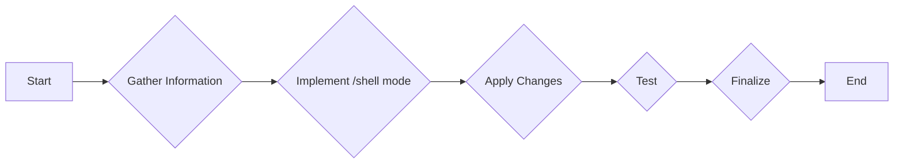

# Ollama REPL: Add /shell Mode Plan

## Goal

Add a `/shell` mode to the `OllamaRepl::Repl` class in `lib/ollama_repl/repl.rb` that executes the input as a shell command.

## Plan

1.  **Gather Information:**
    *   Read the contents of `lib/ollama_repl/repl.rb` to understand the existing structure and modes. (Already done)
    *   Search for the existing `MODE_RUBY` to understand how it was implemented. (Already done)
    *   Ask clarifying questions about the desired behavior of the `/shell` mode. (Already done)

2.  **Implement the `/shell` mode:**
    *   Add `MODE_SHELL` constant.
    *   Add a `when '/shell'` clause to the `handle_command` method.
    *   Add a `handle_shell_input` method similar to `handle_ruby_input`.
    *   Update the `current_prompt` method to include a shell prompt.
    *   Update the `display_help` method to include the new `/shell` command.
    *   Implement the `capture_shell_execution` method to execute shell commands and capture output.

3.  **Apply Changes:**
    *   Use `apply_diff` to add the new mode and functionality to `lib/ollama_repl/repl.rb`.

4.  **Test:**
    *   Ask the user to test the new `/shell` mode and provide feedback.

5.  **Finalize:**
    *   Write the plan to a markdown file. (This step)
    *   Switch to code mode to implement the solution.

## Mermaid Diagram

The `/shell` mode will inherit the current working directory of the Ruby process.